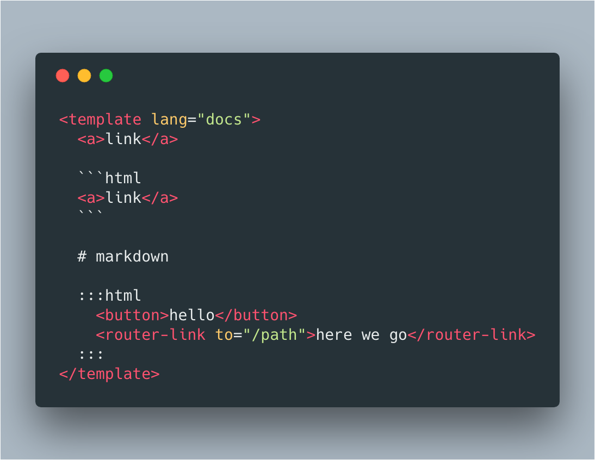

# vue-doc-loader

## usage

- vue-loader config
```javascript
{
  test: /\.vue$/,
  use: [
    {
      loader: 'vue-loader',
      options: {
        loaders: {
          docs: 'vue-doc-loader'
        },
      }
    },
  ]
}
```

- In `.vue` file


- Something show below

